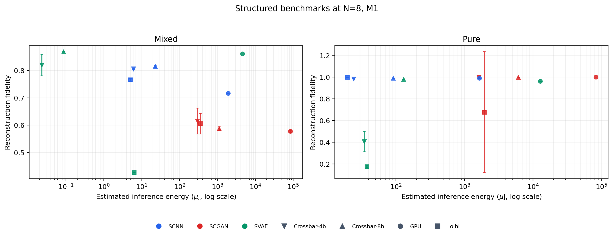
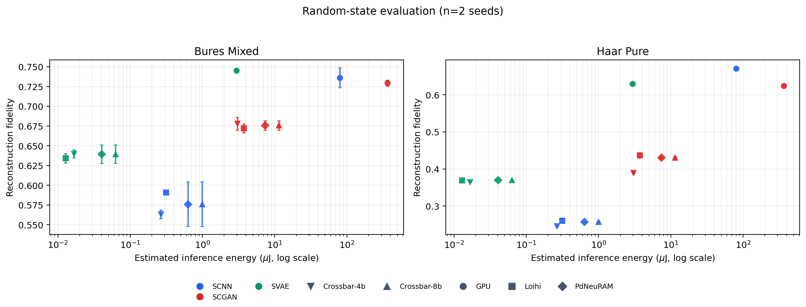
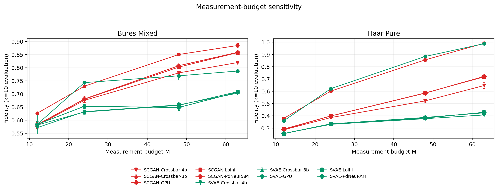

# SpikeQST reproducibility repository

This repository contains the supplied multi-seed experiment scripts and processed results for **SpikeQST: Hardware-Aware Neuromorphic Inference for Energy-Efficient Quantum State Tomography**. It covers SCNN, SCGAN, and SVAE reconstruction, structured GHZ/Werner benchmarks, random-state evaluations, measurement-budget sweeps, and analytical deployment-cost models.

## What is included

- `multiseed/scripts/`: the 17 supplied training, benchmark, sweep, and export scripts.
- `multiseed/results/published/`: the supplied CSV/XLSX result snapshot.
- `analysis/summarize_results.py`: schema validation and deterministic result-figure generation.
- `figures/`: generated PNG and vector PDF figures.
- `docs/results.md`: data-derived result summary with evidence limitations.
- `docs/reproducibility.md`: protocol, run commands, and known dependencies.
- `docs/data_dictionary.md`: definitions for the published result columns.

## Result snapshot

The structured $N=8, M1$ data report a numerical maximum fidelity of $0.9998 \pm 0.0001$ for SCGAN-GPU on pure states and $0.8677 \pm 0.0007$ for SVAE-Crossbar-8b on mixed states. The random-state table uses only two seeds, so its values are descriptive rather than statistically resolved architecture rankings.







See [the complete result summary](docs/results.md) for the measurement-budget and hardware-sensitivity findings and their limitations.

## Recreate the published summaries

Create an isolated environment and install the lightweight analysis dependencies:

```bash
python -m venv .venv
```

Windows PowerShell:

```powershell
.\.venv\Scripts\Activate.ps1
python -m pip install --upgrade pip
python -m pip install -r requirements-analysis.txt
python analysis\summarize_results.py
```

Linux/macOS:

```bash
source .venv/bin/activate
python -m pip install --upgrade pip
python -m pip install -r requirements-analysis.txt
python analysis/summarize_results.py
```

The analysis command validates five core result tables and regenerates the PNG/PDF figures plus `docs/results.md`.

## Run a training smoke test

Install the training dependencies. PyTorch installation is platform-specific; for CUDA systems, install the appropriate build from the [official PyTorch installer](https://pytorch.org/get-started/locally/) before installing the remaining packages.

```bash
python -m pip install -r requirements-training.txt
python multiseed/scripts/scnn.py --seed 0 --out_dir multiseed/results/seed0/scnn --quick --device cpu
```

Equivalent entry points are `scgan.py` and `svae.py`. The scripts write seed-scoped outputs and checkpoints under the supplied `--out_dir`.

## Important scope limitation

The supplied snapshot is not the complete original thesis repository:

- `qst_gen_run_benchmarks.py` and `qst_gen_m_sweep.py` require a top-level `QST_Generalization/` package containing `dataset.py`, `models.py`, `train.py`, `energy_model.py`, `eval_multisample.py`, and `qst_utils.py`.
- `fpga_train_export.py` requires `FPGA Hardware/scripts/train_and_export*.py`.
- Those components were not among the supplied files and therefore are not included here.

The 17 supplied scripts pass Python syntax compilation. Full training execution was not validated in this repository because the omitted modules and the original pinned PyTorch/CUDA environment were not provided.

## Evidence statement

Reconstruction fidelities come from trained models. GPU, Loihi-style, crossbar, and PdNeuRAM-inspired energy values are heterogeneous analytical estimates, not direct measurements on one common platform. The FPGA table contains a training-time proxy and must not be interpreted as measured FPGA inference energy.

## Citation and license

No software license or final code-authorship metadata was included with the supplied files. Until the repository owners select a license, default copyright applies and reuse permission is not granted. Add a `LICENSE` and validated `CITATION.cff` before making the repository public.
